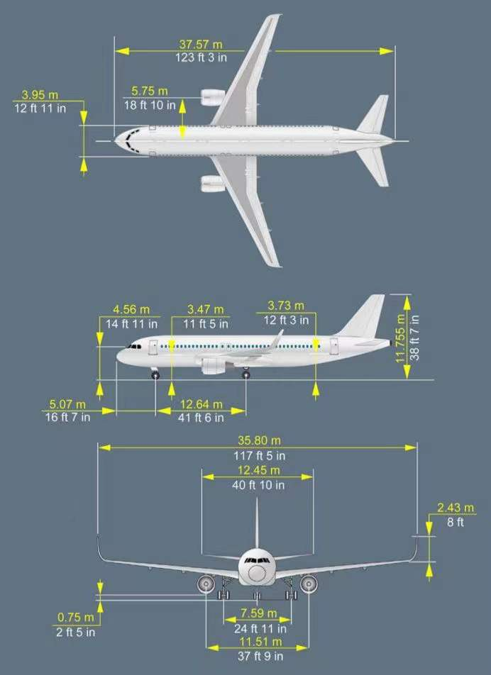

# 飞机概述

## 主要尺寸
> 
> 图为A320-232（带翼梢小翼）

### 机型总结（__记忆项目__）

|数据 \ 机型|A319|A320|A321|
|---|---|---|---|
|长|33.84|37.57|44.51|
|宽（无小翼）||34.1|
|宽（有小翼）||35.8|
|高||11.755|
|主轮距||7.59|
|前轮与机鼻||5.07|
|前轮与主轮间距|11.04|12.64|16.91|
|180度理论最小跑道宽|20.5|22.8|28.3|
|180度干跑道无裕度*|21|24|30|
|最大转弯角||75|
|有效转弯角|70.3|70.2|71.6|
|擦机尾极限（压缩）|14.0|11.7|9.7|
|擦机尾极限（伸展）|15.5|13.5|11.2|

> _注：A319全无小翼， A32xNEO全有小翼_\
> *关于180度转弯，当跑道湿或污染，考虑额外裕度

驾驶舱看地面的目视几何距离为12.5m（思考题`#31A6189`）
